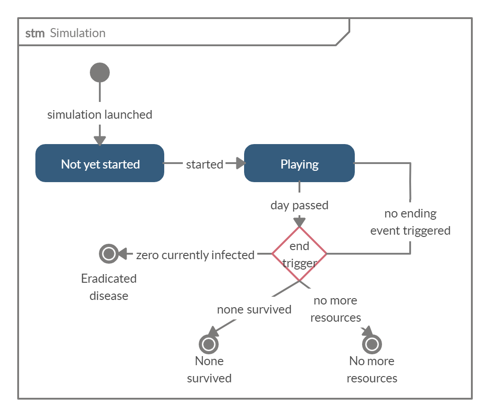
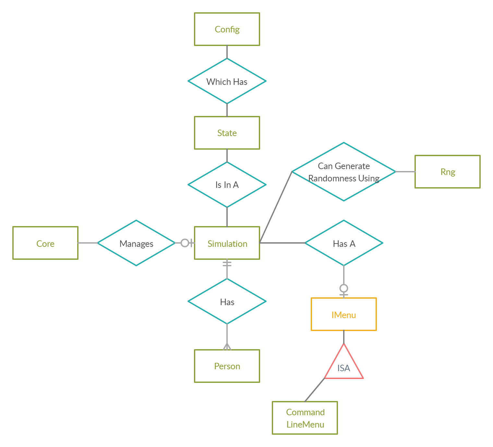

# Epidemic-Simulator-Metod2020 versione 1.00
***Epidemic-Simulator-Metod2020*** è un software che implementa un modello in grado di simulare le epidemie per studiare gli effetti dell'applicazione di alcune strategie per il loro contenimento.  In questo tipo di implementazione, ogni persona è considerata un individuo, quindi è l'istanza di una classe e possiede i suoi attributi.

Il codice di questo progetto è stato progettato e scritto da [IlPakoZ](https://github.com/IlPakoZ), [JackPugno](https://github.com/JackPugno), [LafaDR-23](https://github.com/LafaDR-23), [MrGerboh](https://github.com/MrGerboh), studenti del primo anno di informatica all'[Università la Sapienza di Roma](https://www.uniroma1.it/it/) per l'esame del secondo semestre di [Metodologie di Programmazione](http://wwwusers.di.uniroma1.it/~metodologie_al/index.html), anno accademico 2020.

La versione qui di seguito descritta è la **versione 1.00** del software.

## Rapporti tra i moduli
Qui di seguito sono riportati due **diagrammi UML**.
Il primo è uno **State Diagram** e rappresenta la transizione tra gli stati all'interno di un oggetto della classe `Simulation` in base al ciclo di vita dello stesso. I pallini completamente piani indicano lo **stato iniziale**, i riquadri gli **stati intermedi**, i rombi indicano le diramazioni (*if*)  e i pallini col contorno indicano gli **stati finali**.

 

Il secondo è un **Entity-Relationship Diagram** e rappresenta le relazioni tra i diversi moduli del programma. Notare che ho escluso da questa rappresentazione l'interfaccia `IScenario`, poiché il suo funzionamento non è stato ancora deciso e in questa versione del programma non verrà considerata.
In verde sono rappresentate le **classi**, in giallo le **interfacce** e in azzurro le **relazioni** (che legano tra loro due moduli). In rosso invece sono rappresentate le relazioni di **IsA**, (*"è una"*), che permettono di rappresentare l'ereditarietà (parole chiave `extends` e `implements` in Java). Per informazioni sul significato delle frecce e su come leggere un diagramma ER visitare [questo sito](https://www.lucidchart.com/pages/ER-diagram-symbols-and-meaning) e scorrere in fondo alla pagina.

## Nozioni generali sui moduli
Per comodità, lascio qui sopra un piccolo sommario su cosa rappresentano e come si interfacciano tra loro i vari moduli all'interno del progetto. Molte di queste **definizioni** potrebbero riapparire nella sezione successiva per contestualizzare meglio le spiegazioni più specifiche.
Iniziamo dai moduli contenuti nel package ***sys***, il package che contiene tutti i **moduli di sistema**.

`Simulation` è il **centro** del progetto. 
Tutti i moduli interagiscono in qualche modo con le istanze di tipo  `Simulation`. È la classe che si occupa della simulazione vera e propria, di gestire le azioni da eseguire ad ogni cambio di **giorno/frame** (per sapere di più di come i metodi all'interno di `Simulation` interagiscono tra loro, consultare lo **State Diagram** nella sezione precedente). 

Qui di seguito una spiegazione più approfondita su come i vari metodi all'interno di `Simulation` interagiscono tra loro:
1. la simulazione viene **avviata** in seguito alla chiamata del metodo `run()` avvenuta dall'esterno. La simulazione si trova nello stato `NOT_YET_STARTED`;
2. viene effettuato l'**input dei parametri**. Se l'utente è pronto, attraverso l'interfaccia `IMenu` può decidere di dar via alla simulazione e il metodo `start()` viene chiamato;
3. il metodo `start()` contiene un metodo `loop()` che **si ripete** finché una certa variabile `going` assume valore `False`. È proprio il metodo `loop()` ad aggiornare il valore di `going`. Lo stato della simulazione è aggiornato a `PLAYING`;
4. il metodo `loop()` contiene le azioni che ogni giorno devono essere eseguite. Quando è arrivato il momento di passare al **giorno successivo** viene chiamato il metodo `nextDay()` che esegue tutte quelle operazioni che devono essere eseguite a cambio di giornata. Viene anche chiamato il metodo `feedback()` di `IMenù` per avvertire l'utente che la giornata è cambiata e mostrare il resoconto della giornata (questa funzionalità verrà chiarita più in là nella spiegazione); 
5. quando una delle tre condizioni di fine della simulazione si attiva (`ERADICATED_DISEASE` se non ci sono più contagi, `NONE_SURVIVED` se tutte le persone sono morte e `NO_MORE_RESOURCES` se sono finite le risorse), `loop()` **restituisce falso** ed **esce dal ciclo**;
6. viene chiamata la **procedura di fine** `end()`, che grazie al metodo `finalFeedback(currentState)` dell'interfaccia `IMenu` mostra all'utente il resoconto finale della simulazione (anche questo verrà spiegato meglio più tardi);

All'interno di `Simulation` sono presenti anche i metodi `doSwab` e `contact`, che permettono rispettivamente di **fare il tampone** ad una persona e di **gestire i contatti** tra due persone (con tutte le modifiche al contenuto delle strutture dati che ne derivano, ossia `contacts` e `swabs`, di cui si parlerà più avanti).

Tra gli attributi di `Simulation` è presente un oggetto della classe `State` che rappresenta lo stato della simulazione e contiene tutte le variabili che caratterizzano la simulazione. `State` a sua volta contiene all'interno un oggetto della classe `Config`, in cui è memorizzato il valore di tutti i **parametri di input** forniti prima dell'inizio della simulazione.

Per **interfacciarsi con l'utente**, `Simulation` utilizza un'interfaccia di tipo `IMenu`. Le classi che implementano `IMenu` correttamente (come `CommandLineMenu`) possono essere utilizzate per dare degli ordini alla simulazione in base allo stato in cui si trova. I metodi da implementare per rendere il menù funzionante sono:
1. `int show()`, metodo chiamato da `Simulation` prima dell'inizio della simulazione per permettere all'utente di decidere cosa fare.  Il metodo restituisce un intero, che viene poi letto dal metodo `run` di `Simulation` che lo interpreterà e lo userà per decidere l'azione successiva da compiere. Il significato dei valori restituiti dipende dall'implementazione del precedentemente citato metodo `run` (ad esempio, in questa implementazione restituire `0` significa chiudere il menù ed iniziare la simulazione, restituire `1` significa tornare al menù principale). 
2. `void firstInput(Config config)` si deve occupare di effettuare il primo **input dei parametri**. Questa è la prima schermata del menù che viene mostrata a schermo, pertanto si deve occupare di leggere ***correttamente*** tutti i parametri **obbligatori** (e salvarli nei rispettivi attributi dell'oggetto di `Config` della simulazione). Poiché l'input dei parametri viene effettuato all'interno del menù, i controlli di validità dei dati devono essere effettuati all'interno dello stesso;
3. `int settings(Config config)` mostrerà un menù delle opzioni che permetterà di modificare ***correttamente*** i parametri obbligatori e quelli opzionali. Questo metodo restituisce un intero che verrà utilizzato come l'intero restituito da `int show()`. Decidere un certo valore di ritorno rispetto ad un altro permette all'oggetto `Simulation` di comportarsi in modo differente in base al valore che si vuole restituire (se `settings()` per assurdo restituisse `0`, ad esempio, comporterebbe l'inizio della simulazione appena dopo la chiusura del menu delle opzioni). Anche per questo metodo, come il precedente, è necessario effettuare un controllo sulla correttezza dei dati prima di cedere il controllo alla simulazione;
4. `void feedback(State state)`, conterrà tutte le operazioni da eseguire ad ogni cambio di giorno. Come parametro viene passato lo **stato corrente** della simulazione, in modo da consentire al menù di mostrare a schermo le informazioni che più ci aggradano. Può essere utilizzato, ad esempio, per mostrare a schermo il giorno della simulazione, il numero di infetti totali, giornalieri e qualsiasi altra informazione ricavabile da `State`:
5.  `void finalFeedback(State state)`, conterrà tutte le operazioni da eseguire alla fine della simulazione. Creato per contenere un **report finale** sui dati acquisiti durante le simulazione e per mostrare a schermo informazioni e grafici. In modo del tutto simile a `feedback`, anche questo metodo ha lo stato corrente della simulazione come parametro.

Un oggetto di tipo `Core` invece è il guscio esterno generatore dell'oggetto di tipo `Simulation`.  Infatti, nel metodo `main`, per creare una nuova simulazione si utilizzerà un oggetto di tipo `Core`  che fungerà sia come ulteriore livello di **interfacciamento** verso l'oggetto di tipo `Simulation`, sia per gestire le eccezioni lanciate da esso. Un oggetto di tipo `Core` può ***potenzialmente*** supportare più di una simulazione e permettere il riavvio della simulazione stessa ripristinando o modificando i valori contenuti in `State` o `Config`. All'interno di `Core` sono dichiarate anche delle **annotazioni** per rendere più semplice la condivisione del codice.

La classe *statica* `Rng` implementa la **casualità**. Il modo migliore di agire in casi come questi è proprio utilizzare la casualità per aggiungere la varietà che solitamente è presente in natura e che nelle simulazioni difficilmente è riproducibile in altri modi. Il metodo principale di questa classe infatti, chiamato `generateFortune()` prende in input una ***percentuale*** ed un secondo numero compreso tra `0` e `2` (dove `0` significa **evento certo** , `1`  significa **probabilità immutata** e `2` **probabilità dimezzata**) con i quali bisogna "tirare un dado". Se le sorti sono a favore (o sfavore, dipende dai punti di vista), l'evento deve essere eseguito e il metodo restituisce `True`, altrimenti restituisce `False`. Il secondo parametro, chiamato ***modificatore***, è pensato per essere generato dai metodi `generateDeathModifiers()` e `generateInfectivityModifiers()` in base al contesto (come si può capire dai nomi dei metodi), o addirittura sceglierlo manualmente in caso di necessità. Questo metodo è stato pensato proprio per rendere più semplice l'implementazione delle probabilità nei metodi esterni a `Rng` che le utilizzano.
L'ultimo metodo, chiamato `generatePopulation()`è il metodo che viene chiamato dopo l'input dei parametri e subito prima l'inizio della simulazione. Questo metodo prende come parametri l'**età media della popolazione**, l'**età massima** e la **dimensione del campo** in cui si muoveranno le persone. Attraverso quella che viene chiamata una [***distribuzione Gaussiana o normale***](http://www.edutecnica.it/calcolo/normale/normale.htm) viene generata l'età di ogni singolo individuo, contemporaneamente alle istanze di `Person` stesse. Contemporaneamente, per ognuna di esse, oltre al valore di `age` viene generato anche il `deathModifier` che ne consegue. Viene restituito l'array di istanze di `Person` generato (come parametro del costruttore di `Person`, `index` è uguale al suo indice nell'array appena generato).

Ultima ma non meno importante, `Person` è la classe volta a contenere tutte le informazioni relative ai singoli **individui** (persone) che vivono nella simulazione. Questa classe appartiene al package ***assets***, il package incentrata meno sulle cose tecniche e più sugli oggetti della simulazione (possiamo vedere il package ***sys*** come i componenti che fanno funzionare il gioco, il package ***assets*** come i partecipanti al gioco).
Ogni persona dispone di un metodo `refresh()` che viene chiamato ad ogni giorno e che ha diverse funzionalità:
1. aggiornare la variabile `daysFromInfection` se la persona è infetta (`isInfected == true)`;
2. chiamare il metodo `makeOfColor(ColorStatus color)` per rendere la persona di un certo colore. La variabile `color` di una persona diventa `YELLOW` dopo diseaseDuration\6 giorni, ***può*** diventare `RED` dopo diseaseDuration\3 giorni e ***può*** morire dopo `dayOfDeath` giorni, altrimenti guarisce dopo `diseaseDuration` giorni (per l'implementazione di questa funzione basterà chiamare il metodo `makeOfColor()`, che si occuperà dei cambi di colore);
3. controllare se la persona è ferma e, se sì, togliere una unità di denaro dalle casse dello Stato (`resources`);
4. dopo tot giorni fa morire la persona ***se*** destinata a morire (`dayOfDeath != -1)`.

Come già specificato in precedenza, il metodo `makeOfColor()` di `Person` si occuperà di cambiare il colore della persona, ripristinando la proprietà della ***pentapartizione*** in `startingPopulation`, che divide l'array in 5 parti (da indice `0` a indice `greenYellow` sono contenute tutte le persone che hanno attributo `color = GREEN`, da `greenYellow+1` a `yellowRed` quelli con `color = YELLOW`, da `yellowRed+1` a `redBlue` ci sono quelli `color = RED`, da `redBlue+1` a `blueBlack` i `color = BLUE` e i restanti hanno `color = BLACK`). Questo metodo utilizzerà la classe `Rng` per dare randomicità alle transizioni tra `YELLOW` a `RED` e tra `RED` e `BLACK`.

## Nozioni sulle variabili

Il progetto prende come riferimento le specifiche base assegnate dal professore [qui](http://wwwusers.di.uniroma1.it/~metodologie_al/PROGETTI/progetto20.pdf), modificate in modo tale da permetterci di avvicinarci il più possibile alle caratteristiche di una vera epidemia, che ci avrebbero permesso di simularla e di intervenire nel modo **più naturale possibile** per regolare, modificare o contrastare la diffusione dell'epidemia in base ai **parametri di input**.

I nostri parametri di input saranno contenuti in un'istanza della classe `Config`, di cui ogni simulazione è fornita; a loro volta, l'istanza di `Config` e le altre variabili di lavoro di cui ogni simulazione deve essere disposta sono contenute in un'istanza di `State`, che rappresenta lo stato corrente della simulazione.

I parametri di input **obbligatori** di una simulazione sono:
- `ageAverage`, media dell'età della popolazione;
- `populationNumber`, numero di persone di cui è composta la popolazione;
- `resources`, le risorse di cui si dispone per combattere l'epidemia;
- `swabsCost`, costo di un tampone;
- `infectivity`, la probabilità che un individuo sano venga infettato a seguito di un incontro con un contagiato asintomatico o sintomatico;
- `sintomaticity`, la probabilità che un contagiato sviluppi sintomi;
- `letality`, la probabilità che un sintomatico muoia;
- `diseaseDuration`, la durata della malattia.

I parametri di input **opzionali** di una simulazione sono:
- `velocity`, media delle persone nello stesso punto giornaliere (di default `1`);
- `dayDuration`, la durata in millisecondi di un giorno (di default `500`);
- `masks`, segnala se l'utilizzo delle mascherine è abilitato; diminuisce l'infettività (di default `false`).
- `socialDistance`, distanza sociale tra le persone, se non modificata corrisponde a populationNumber\velocity (di default, uguale a `populationNumber`)

Altra classe essenziale per comprendere il funzionamento del programma è `Person`. La classe `Person` rappresenta la persona, l'individuo. Ogni istanza della classe possiede almeno i seguenti attributi:
- `age`, rappresenta l'età dell'individuo, generata alla creazione di `startingPopulation`;
- `index`, rappresenta la sua posizione in `startingPopulation`, della classe `Simulation`;
- `color`, istanza dell'enumerazione `ColorStatus`, Può assumere cinque valori diversi in base allo **stadio della malattia**, tra cui `GREEN` se l'individuo è sano o in incubazione, `YELLOW` se l'individuo è asintomatico, `RED` se l'individuo è sintomatico, `BLUE` se è guarito e `BLACK` se è morto;
- `movement`, istanza dell'enumerazione `MovementStatus`. Può essere impostata a `MOVING`, per specificare che una persona è in movimento, `STATIONARY` se è ferma;
- `dayOfDeath`, generato appena la persona diventa sintomatica, specifica dopo quanti giorni di malattia la persona morirà (di default, `-1` se non ancora destinata a morire);
- `daysFromInfection`, rappresenta quanti giorni sono passati dall'infezione. Insieme al parametro `diseaseDuration`, permettono all'istanza di `Person` di passare da un valore di `ColorStatus` ad un altro (di default, `-1` se non ancora infetto);
- `deathModifier` e `infectivityModifier`, indica il valore dei modificatori di probabilità di morte e di infettare qualcuno in base rispettivamente all'età della persona e a se indossa una mascherina. Questi due valori sono generati dai metodi `generateDeathModifiers` e `generateInfectivityModifiers` della classe `Rng`;
- `isInfected`, booleano che indica se la persona è infetta oppure no. Se una persona è infetta, ogni giorno bisogna incrementare il valore di `daysFromInfection` (permette di distinguere i sani da quelli in incubazione);
  
La simulazione utilizza anche molte **variabili di lavoro**, molte delle quali originate dai parametri di input, che ne permettono la corretta esecuzione.  
Per motivi di fattibilità, è **impossibile** prevedere quali e quante variabili saranno effettivamente utilizzate per l'implementazione dei metodi a priori: come conseguenza di questo, ho deciso di dichiarare nello scheletro del programma le variabili e le classi che ragionevolmente potrebbero tornare utili, lasciando comunque libera scelta nel caso nasca la necessità di crearne delle nuove o di eliminarne alcune inutilizzate.
Qui di seguito sono elencate le variabili di lavoro della classe `Simulation`, che rappresenta il **centro del programma** (il punto in cui avviene la simulazione effettiva) e che, come già detto, sono contenute nell'oggetto di tipo `State` associato:
- `configs`, oggetto di tipo `Config`, contiene tutti i parametri della simulazione;
- `startingPopulation`, vettore fisso di istanze di `Person`, contiene la popolazione iniziale; su questo vettore è applicata una **pentapartizione**, che divide l'array in 5 parti. Da indice `0` a indice `greenYellow` sono contenute tutte le persone che hanno attributo `color = GREEN`, da `greenYellow+1` a `yellowRed` quelli con `color = YELLOW`, da `yellowRed+1` a `redBlue` ci sono quelli `color = RED`, da `redBlue+1` a `blueBlack` i `color = BLUE` e i restanti hanno `color = BLACK` (questa implementazione potrebbe tornare utile per alcune operazioni, ma nel caso l'utilità si riveli dubbia, in versioni future potrebbe tranquillamente essere sostituita);
- `vd`, il numero di incontri che ha in media un individuo, **sia fermo o in movimento**, nel corso di una giornata;
- `r0`, fattore di contagiosità, calcolato ogni giorno come V_d * diseaseDuration * populationNumber;
- `contacts`, istanza di `HashMap` (dizionario) che possiede come chiave un oggetto di tipo `Person` **asintomatico o sintomatico** e come valore un `ArrayList` (array) che contiene le persone sane (sempre istanze di `Person`) con cui è entrato in contatto da quando è diventato asintomatico.  Questo dizionario sarà utile nell'implementazione dello **scenario** con i tamponi;
- `swabs`, istanza di `HashSet` che contiene tutte le istanze di `Person` che sono risultate positive al tampone. Questa struttura è di dubbia utilità;
- `unoPatientFound`, booleano che vale `True` se è apparso il primo rosso. Una volta trovato, è possibile iniziare ad attuare misure  di contenimento (né applicare tamponi, né tracciare gli incontri, né fermare individui);
- `status`, istanza dell'**enumerazione** `SimulationStatus` , contiene lo status della simulazione (utile a scopo diagnostico);
- `totalInfected`, di tipo `ArrayList<Integer>` che tiene traccia di come cambia il numero di infetti totali giorno per giorno;
- `dailyInfected`, di tipo `ArrayList<Integer>` che tiene traccia di come cambia il numero di infetti giornalieri giorno per giorno. Questa struttura dati è ricavabile dalla precedente ma, per questione di comodità, poiché non occupa molto spazio, viene generata insieme alla precedente direttamente durante la simulazione:
- `greenYellow`, `yellowRed`, `redBlue` e `blueBlack`, di cui ho parlato in precedenza, servono come indici per la ***pentapartizione***.

Detto questo, abbiamo le conoscenze necessarie per iniziare a parlare effettivamente di cose più tecniche: caratteristiche base della simulazione, priorità dei lavori e la loro suddivisione, gruppi di lavoro e altro.

## Specifiche da implementare e informazioni tecniche

Alcune informazioni meramente tecniche non sono ancora del tutto definite: il metodo di implementazione del sistema del contagio deve ancora essere chiarito e verrà descritto qui di seguito soltanto dopo l'implementazione.
Qui di seguito verranno descritte le caratteristiche che deve essere in grado di fornire il modello:
1. ogni simulazione inizia con una certa quantità di **risorse iniziali** (`resources`); 
2. `resources < populationNumber * diseaseDuration` e `resources < 10 * populationNumber * swabsCost`;
3. ogni individuo fermo consuma una risorsa, un individuo in movimento invece non fa perdere nessuna risorsa;
4. un individuo in incubazione **non** è contagioso e non è rilevabile dal tampone;
5. un individuo con la mascherina ha meno possibilità di infettare qualcun altro, un individuo di età più avanzata ha più possibilità di sviluppare sintomi gravi e pertanto morire;
6. quando due persone entrano in contatto tra loro e uno dei due è `YELLOW` o `RED` mentre l'altro è sano, allora c'è ***una possibilità*** che avvenga il contagio, in base al parametro `infectivity`;
7. un individuo `RED` **deve** essere fermato automaticamente perché i suoi sintomi sono evidenti; nonostante la persona sia ferma, le persone accanto ad essa possono imbattersi nella persona dando vita di fatto ad un contagio, finendone eventualmente contagiate. Le persone `RED` si curano e per questo consumano `3*swabsCost` al giorno;
8. un individuo `YELLOW` può venire fermato ma solo in seguito alla decisione dell'utente di voler applicare delle contromisure specifiche (***strategie***) volte a rallentare il contagio (ad esempio, metà della popolazione viene fermata, i contatti dei contagiati vengono fermati, oppure vengono effettuati tamponi e i positivi vengono fermati ecc..);
9.  un individuo `YELLOW` diventa `RED` se al giorno diseaseDuration\3 il metodo `generateFortune()` della classe `Rng` restituisce `True`;
10. quando un individuo passa da `YELLOW` a `RED` viene chiamato un'altra volta il metodo `generateFortune()` per capire se la persona dovrà sopravvivere oppure no e, se il risultato è `True`, verrà generato anche il giorno della sua morte (`dayOfDeath`);
11. un individuo fermo **non** può ricominciare a muoversi se non dopo essere diventato `BLUE` (dopo `diseaseDuration`);
12. per contrastare l'epidemia possono essere applicate varie strategie; la strategia di **default** consiste nel non effettuare nessun tampone e lasciare che la malattia si esaurisca da sola (fermando soltanto i `RED`);
13. non è possibile applicare nessuna strategia per il contenimento dei contagi, applicare tamponi o tracciare i contatti prima che venga trovato il primo `RED` (`unoPatientFound == True`).

Le strategie da implementare (che non siano quella di default) verranno elencate qua sotto (i cosiddetti ***scenari***). Per tutte queste strategie vale la premessa che i positivi al tampone debbano essere fermati:

1. vengono testate col tampone persone a caso ogni giorno;
2. vengono testati **tutti** i contatti sani che ha avuto una persona infetta prima che risulti positiva al tampone;
3. vengono fermate persone a caso per un tot di tempo;
4. tutti o una parte della popolazione usa le mascherine (che però hanno un costo per lo stato).

Adesso parliamo delle ***priorità*** dei lavori: ovviamente, come potete immaginare, non tutte le cose da fare hanno la stessa priorità e ci sono cose che non possono nemmeno essere testate senza l'implementazione di alcune funzionalità base. Qui di seguito elencherò quello che è necessario implementare in ordine di priorità:

1. `start()`, `loop()` e `nextDay()` della classe `Simulation`;
2. `generatePopulation()` della classe `Rng`;
3. `makeOfColor()` della classe `Person`;
4. `refresh()` della classe `Person`;
5. `contact()` della classe `Simulation`;
6. `show()`, `firstInput()` e `feedback()` della classe `CommandLineMenu`;
7. `settings()`, `finalFeedback()` della classe `CommandLineMenu`;
8. `generateFortune()` della classe `Rng`;
9. `generateDeathModifiers()` e `generateInfectivityModifiers()` della classe `Rng`;
10. `doSwab()` della classe `Simulation`;
11.   gestione della logica per tenere traccia dei contatti, ossia di quando tenere traccia delle persone incontrate e quando e come fare i tamponi alle persone incontrate, classe `Simulation`;
12. `end()` della classe `Simulation`;
13. implementare la logica degli scenari in `Simulation` e gestire la selezione dello scenario in `CommandLineMenu` (prima di tutto, pensare ad un modo per far scegliere lo scenario all'utente e per far capire al programma di star eseguendo uno scenario specifico, con tutto ciò che ne deriva);
14. `loadConfigs()`, `getConfigs()` della classe `Simulation` e metodo `run()` di `Core`;
15. varie ed eventuali, Easter Eggs e nuove features.

L'idea è di dividere il gruppo in due ulteriori semi-gruppi che si occuperanno di cose differenti. Non necessariamente le persone nello stesso gruppo dovranno fare le stesse cose, ma è importante incontrarsi in chiamata (al meno con l'altra persona del semi-gruppo) e scambiarsi idee e contraddittori. Io, Pasquale, in qualità di leader **auto-eletto**,  accetterò di buon grado di entrare in chiamata con gli altri componenti del **team** (che facciano o meno parte del mio semi-gruppo) che abbiano bisogno di idee o non abbiano chiaro qualcosa del progetto.

Insieme a qualcun altro, mi occuperò dell'implementazione della classe `Simulation` (tranne il metodo contact(), almeno per adesso) e di alcuni metodi della classe `Rng`. 

Per evitare che il lavoro di altri venga sovrascritto, è ***raccomandato*** che ogni gruppo lavori su classi separate in un determinato momento; se ciò non è possibile, si procederà ad aggiungere il codice manualmente. Per rendere più agevole questo processo di suddivisione dei compiti, posterò nella sezione ***Issues***  del repository GitHub i lavori da eseguire e a chi sono assegnati. 
Si lavorerà su un branch del repository chiamato ***dev***, su cui verranno fatti tutti i *commit* e i *push*: solo quando si è sicuri che il codice sia funzionante verrà effettuato il *merge* (fusione) con il branch principale (**master**).

Se avete letto fino a qui, siete quasi pronti per la programmazione. 
Ultima informazione riguarda le annotazioni, ossia `@NotImplemented`, `@ToRevise` e `@Ready` da mettere prima del nome dei metodi. 
La prima verrà utilizzata per indicare agli altri membri del team che il metodo non è ancora funzionante; la seconda viene utilizzata per indicare che il metodo dovrebbe funzionare e deve essere soltanto ricontrollato e testato, mentre il terzo per indicare che il metodo è stato controllato ed è pronto per l'esecuzione.
Importante è anche **commentare** i metodi quando possibile e ragionevole: ricordate che non state programmando solo per voi stessi, e probabilmente se non vi avessi lasciato uno straccio di commento / spiegazione sulla mia idea a questo punto non avreste capito nulla di come ho strutturato il progetto e di quello che ho scritto nei moduli. 
Più importante: prima di iniziare a programmare, concentratevi prima di riuscire a capire in maniera discreta come ho organizzato il progetto e le cose che devono essere fatte, poiché di questo progetto dovrete con tutta probabilità discutere anche voi all'esame. 
Ancora più importante: se non volete ritrovarvi a riscrivere duecento volte lo stesso frammento di codice, pensate ad un algoritmo **funzionante** ed **abbastanza efficiente** che si coordini con il resto del progetto per risolvere il problema in questione prima di iniziare effettivamente a programmare. 

Vi lascio all'ultima sezione di questo file, ossia la descrizione delle caratteristiche che potremo aggiungere al progetto nelle versioni future.

## Versioni future
Abbiamo parlato delle caratteristiche che dovrà avere il simulatore di base, ***versione 1.0.0***. Oltre a queste però, sono presenti altre ***features*** che sarebbe bello implementare e che, tempo permettendo, potranno essere implementate nelle versioni successive:
1. la contagiosità degli infetti cambia in base all'entità dei sintomi;
2. il tampone non va a buon fine sempre (può accadere che ci siano dei falsi negativi, e questo varia anche in base allo stadio della malattia in cui ci si trova);
3. la malattia ha una durata base uguale a `diseaseDuration`, ma non dura effettivamente lo stesso per tutti (questo può cambiare in base all'età, all'entità dei sintomi o anche a caso);
4. aggiungere, oltre al tag `STATIONARY` che indica le persone ferme, anche un tag `QUARANTINED` che appartiene a tutte quelle persone con sintomi e che non vengono proprio più considerate nel calcolo dei contatti;
5. creare centri di addensamento (ospedali, negozi) in cui si incontrano le persone più spesso;
6. non tutti quelli positivi rispettano le direttive di stare a casa, quindi con `generateFortune()` si simulano coloro che non rispettano le regole;
7. anche i fermi devono recarsi ai negozi, quindi ricominciano a muoversi solo per il tempo necessario di andare al negozio;
8. possibilità di aggiungere scenari personalizzati;
9. possibilità di **riavviare** una simulazione una volta terminata.

Per quanto riguarda gli scenari, questi sono quelli che potremmo aggiungere (si potrebbe anche aggiungere una sezione del menù che permetta di scegliere quale combinazione di misure applicare):

1. possibilità di scegliere una combinazione delle strategie precedenti;
2. lo Stato [**se ne frega**](https://www.youtube.com/watch?v=rJWyLujJBBg) della malattia e non cura nessuno.

Ecco anche alcuni Easter Egg che potrebbero essere inseriti nel programma (sezione **easter eggs**):

1. modalità ***Unione Europea***, garantisce risorse illimitate per combattere l'epidemia;
2. modalità ***Paese del Terzo Mondo***, risorse basse e probabilità di contagio, sintomaticità e morte più elevate;
3. modalità ***China***, lo Stato sa tutto e le persone asintomatiche vengono fermate al minimo sintomo;
4. modalità ***Tutti depressi***, le persone si muovono meno spesso o più lentamente;
5. modalità ***Religione***, vieni risparmiato dalla malattia se sei credente;
6. modalità ***Capitalismo***, le persone guadagnano di più o di meno in base alla classe sociale in cui appartengono.

## Saluti finali

Bene.
Detto ciò, pirati programmatori, potete iniziare la vostra avventura nel fantastico mondo del progetto! 
Appena avrete capito per bene come funziona il progetto, contattatemi sul nostro gruppo whatsapp e vi aggiornerò su come continuare!

Cya, Pasquale!
